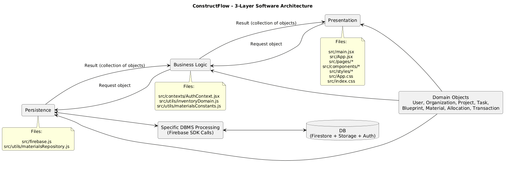

## Deliverables

[Link to Jira Board](https://khalifihabdulrazaq.atlassian.net/jira/software/projects/CFLOW/boards/2)

### ITR0

[Planning Document.pdf](deliverables/Planning%20Document.pdf) is in the `deliverables` folder.  
Customer meeting’s summary video: https://youtu.be/ytbclsm6Geg [](https://youtu.be/ytbclsm6Geg)

### ITR1

[log.md](deliverables/log.md) is in the `deliverables` folder.

"Planning Document.pdf" has been revised. New document is in the `deliverables` folder titled [PlanningDocument-UpdatedMarch1.pdf](deliverables/PlanningDocument-UpdatedMarch1.pdf).  
Change made:  
Blueprint is used as a helper for the tasks assigned, rather than it serving as the main workspace. Our customer suggested using the blueprint feature as an addition to assigning tasks to promote better organization and clarity. Having the blueprint as the main workspace would cause confusion for the workers.

### Delivery 1

[Peer evaluation form](deliverables/EECS2311Z-Delivery1-PeerReview-Group9.pdf) is in the `deliverables` folder.

### ITR2

Updated user stories: [ITR2-user-stories](deliverables/ITR2-user-stories.pdf)

#### UML Class Diagram

The UML class diagram was created using [Plant UML](https://plantuml.com/).  
Here is the code: [uml-class-diagram.puml](deliverables/uml-class-diagram.puml).  
Here is the image: [uml-class-diagram.png](deliverables/uml-class-diagram.png).

### ITR3

The implemented and tested user stories (Lab 5 Activity 1 doc): [User Stories](deliverables/EECS2311-SectionZ-Team9-TakeHomeAssignment.pdf).  
Architecture Diagram: [Diagram](deliverables/architecture-sketch.png).

### Delivery 2

UML Class Diagram: [Diagram](deliverables/updated-class-diagram.png).   
Second customer interview: https://youtu.be/eGXfIey8c9c [](https://youtu.be/eGXfIey8c9c)    
Peer Evaluation Form: [Delivery 2 Peer Evaluation Form](deliverables/EECS2311Z-Delivery2-PeerReview-Group9.pdf)

---

# ConstructFlow

A work management system for plumbing and electrical work in construction.

## 3-layer Architecture Sketch



## How to run

To run this app locally, you'll need:

- **Node.js** (v18 or higher)
- **npm** (comes with Node.js)

You can download Node.js (includes npm) from [nodejs.org](https://nodejs.org/).

To check your version:

```bash
node --version
npm --version
```

After you've downloaded Node.js:

```bash
cd constructflow
```

Then follow the directions in [constructflow/README.md](constructflow/README.md).

## How to test

Follow the directions in [constructflow/README.md](constructflow/README.md) Testing section.

## Features

- **Role-based dashboards** - Distinct interfaces for managers and workers
- **Worker management** - Manage crew members and assign them to tasks
- **Blueprint handling** - Upload and view construction blueprints with section assignments
- **Task assignment** - Assign specific work to workers
- **Real-time authentication** - User sign-up and login with email/password

## Tech Stack

- **Languages:** JavaScript, HTML, CSS
- **Frontend:** React
- **Build tool:** Vite
- **Backend Services:** Firebase
- **Database:** Firebase Firestore
- **Authentication:** Firebase Auth

## Repository Structure

A more detailed repository structure is in the project's GitHub Wiki.

```
project-group-9-constructflow/
├── constructflow/              # Main application (React/Vite)
├── deliverables/               # Submission documents for the iterations
└── README.md                   # Project overview
```
